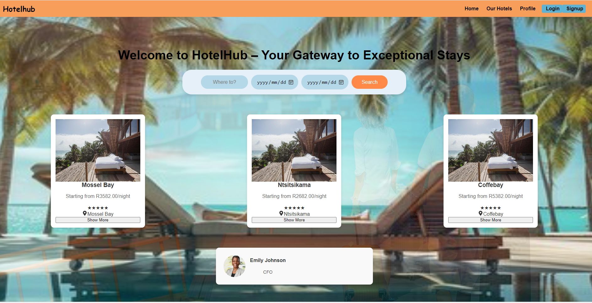
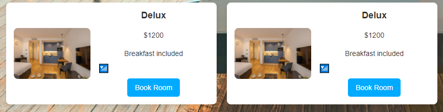
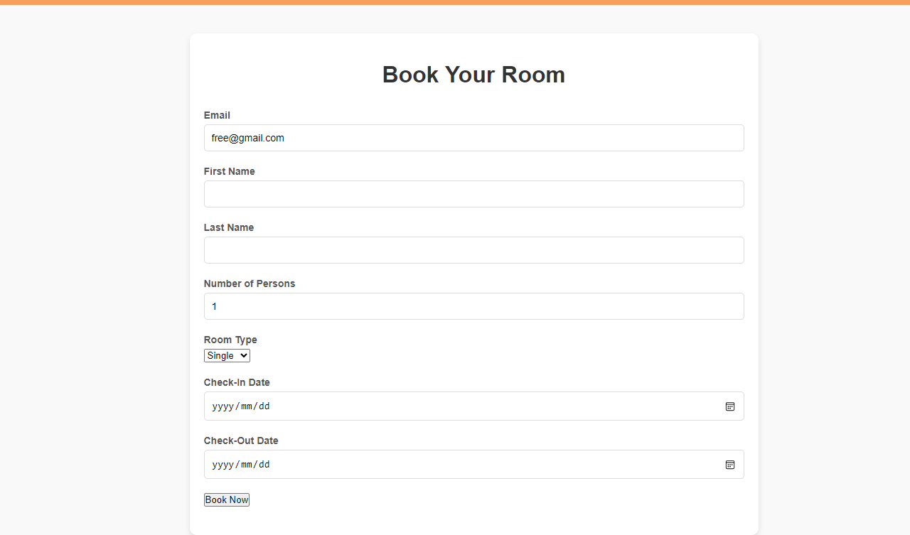
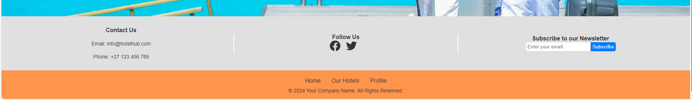

# Hotel Booking App

## Description
**HotelHub** is a comprehensive hotel booking application that provides users with a seamless experience for finding and booking hotels. Users can view available hotels, manage their profiles, and make payments easily. For administrators, HotelHub offers a powerful dashboard to manage hotels, users, and system statistics efficiently.

## Features

### User Features
- **Home Page**: A welcoming interface for users to start their hotel booking journey.
- **Our Hotels**: Browse a list of available hotels with detailed descriptions and images.
- **Profile**: Users can manage their personal information and booking history.
- **Pay Now**: Secure payment options for confirmed bookings.
- **Book Now**: Effortlessly book rooms with real-time availability.
- **Contact Information**:
  - **Email**: [info@hotelhub.com](mailto:info@hotelhub.com)
  - **Phone**: +27 123 456 789
- **Follow Us**: Connect with us on social media for updates.
- **Newsletter Subscription**: Users can subscribe to our newsletter by entering their email address.

### Admin Features
- **Admin Home Page**: Centralized dashboard for managing the application.
- **Dashboard**: Access to system statistics and user management tools.
- **Profile Management**: Admins can view and edit their profiles.
- **Login / Sign Up**: Secure authentication for admin access.
- **Recent Updates**:
  - Newly implemented user registration system.
  - Ongoing bug fixes and performance improvements.
  - New analytics features available in the dashboard for better decision-making.

## Figma Designs
Explore the design mockups for the HotelHub app on Figma:
- [Figma Design Link](https://www.figma.com/proto/qK3URJLECsMsiJB0GtkVsH/Untitled?node-id=0-1&t=ZLwFUdpGddQEypQD-1)

## Screenshots
Here are some screenshots of the HotelHub application:


*Home Page*


*Our Hotels Page*


*footer

*User Profile Page*

## Installation
1.  repository:
   ```bash
   git clone https://github.com/Siphe23/Booking-hotel-app.git
